<div align="center">

# MedRec

</div>

Medical records need innovation. Patients leave data scattered across various jurisdictions as life events take them away from one provider’s data to another. In doing so, they lose easy access to past data, as the provider, not the patient, generally retains primary stewardship. Patients thus interact with records in a broken manner that reflects the nature of how these records are managed. Patients with a huge medical history across many hospitals should not have to keep their history in the form of huge Patients and providers may face significant hurdles in initiating data retrieval and sharing due to economic incentives that encourage “health information blocking”. In the age of online banking and social media, patients are increasingly willing, able and desirous of managing their data on the web and on the go. This work explores a blockchain structure with its backend based on a Rinkeby Test network using Ethereum for its data storage and a smart contract for its data logic. Medical Records are data with sensitive information, and hence using DAPPS with smart contracts ensures safety features essential such as Zero Downtime (i.e. the data associated with a patient is always ready to be fetched and updated), Privacy (A Patient's data should be secured and of limited accessibility to only the people closely associated with the patient), Complete data integrity (The data must not be changed by someone in no authority to do so). This MedRec blockchain implementation seeks to solve this vast fragmentation of patient data by bringing it together and organizing it in the form of a ledger while providing it with the benefits provided by blockchain and DAPPs.

Hence, by implementing Medical records on the blockchain we achieve the following features which by other means could only be partially fulfilled or not fulfilled at all.

1. Non-Repudiation of Medical Records, i.e. once the prescription is received by a patient from a doctor, the transaction is stored digitally on the blockchain signed by the private keys of both the patient and the doctor, hence if either party refuses to claim the ownership of the transaction, it can be easily detected using the public key of both.
2. Only the authorized doctor can suggest a prescription that is to be added to the patient records.
3. The integrity that the prescription once added cannot be modified by any of the parties involved, i.e. the doctor, the patient or an attacker trying to harass the patient.
4. Automated transactions using smart contracts i.e. Once the patient authorizes a doctor to suggest a prescription, money is automatically transferred from the patient’s wallet to the patient contract and once the doctor sends a prescription, the money is transferred from the patient contract to the doctor’s wallet. The prescription to be sent is based on the mutual trust between the doctor and the patient and is not regulated by the application.

5. The contracts were created with vulnerabilities like Re-entrancy, transaction ordering, value underflow-overflow etc. in mind hence the application is safe to use under such circumstances if they shall prevail.


<div align="center">

## Contents

[Download APK](#Download-APK) • [How to Use](#how-to-use) • [Screenshots on Android](#screenshots-on-Android) • [Screenshots on Linux](#screenshots-on-Linux) • [Libraries & Tools Used](#libraries--tools-used) •  [Folder Structure](#folder-structure) • [Routes](#routes) • [Main](#main) • [Contracts](#Solidity-Contracts) 

</div>


## Download APK
You can download the latest installable version of MedRec for Android from `Releases` or using this link: [MedRec.apk](https://github.com/Abhishekkr3003/MedRec/releases/download/v1.0.0/MedRec.apk)


## How to Use 

Steps working for Android, IOS, MacOS, Windows, Linux and Web.

**Step 1:**

Download or clone this repo by using the link below:

```
https://github.com/Abhishekkr3003/MedRec.git
```

**Step 2:**

Go to project root and execute the following command in console to get the required dependencies (make sure you have flutter installed successfully): 

```
flutter pub get 
```

**Step 3:**

Connect your device and run:

```
flutter run 
```


## Screenshots on Android
<table>
  
  <tr>
    <td>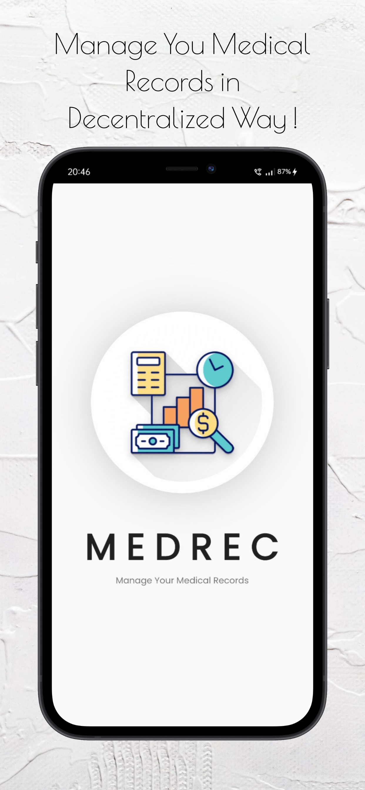</td>
    <td>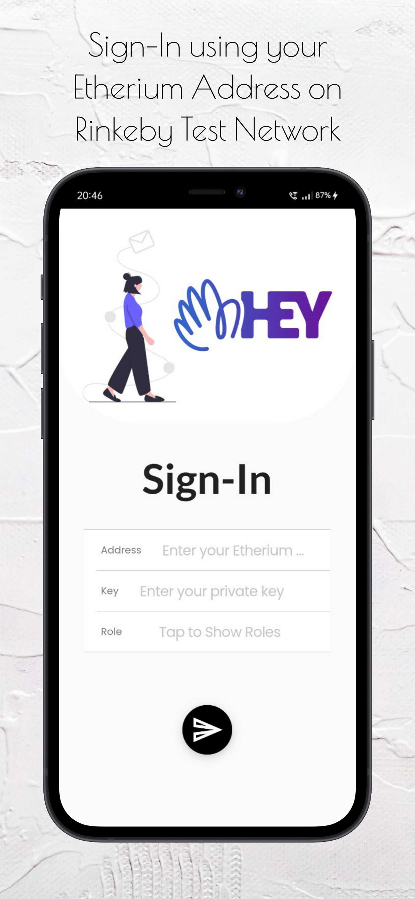</td>
    <td>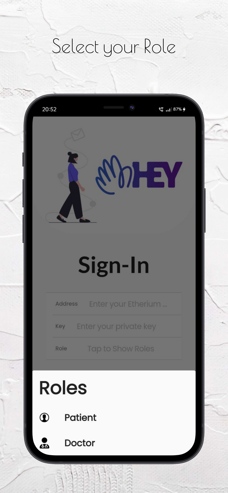</td>
  </tr>
  <tr>
    <td>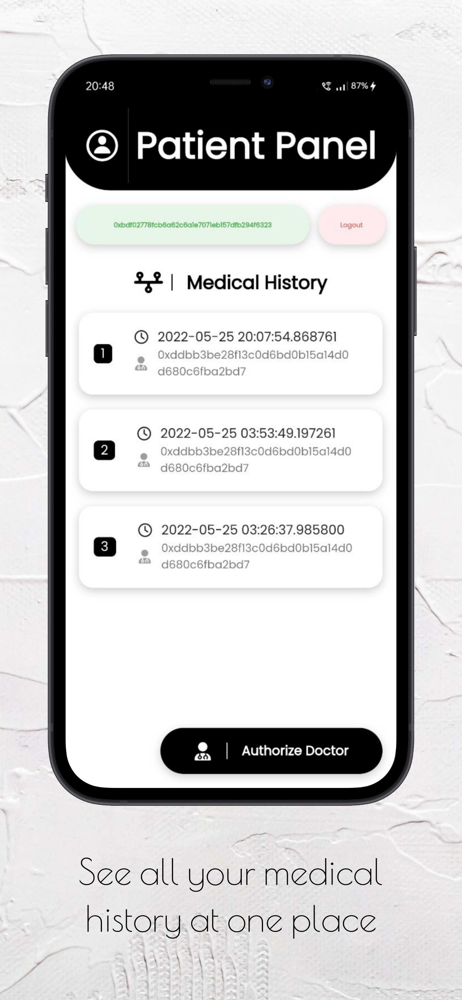</td>
    <td>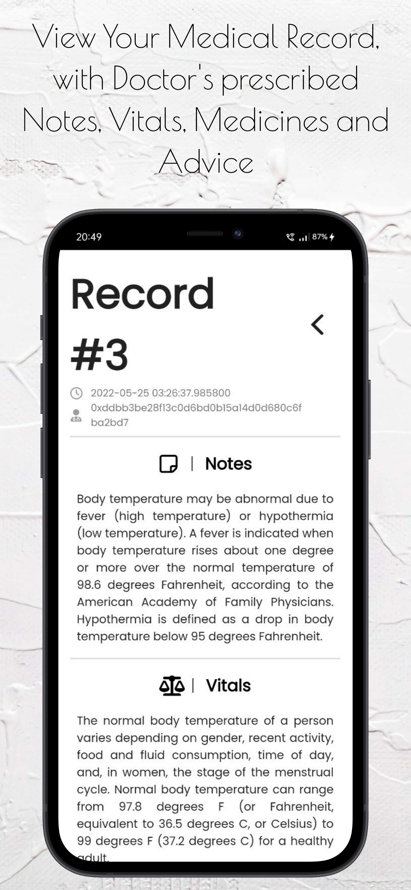</td>
    <td>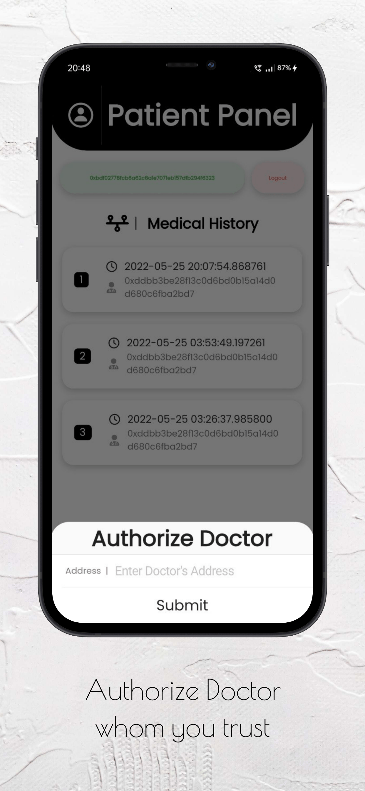</td>
  </tr>
  <tr>
    <td>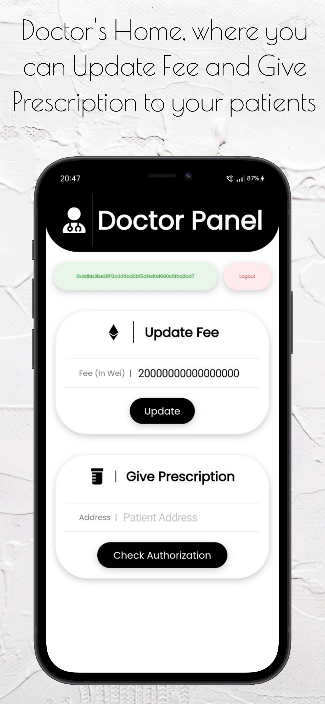</td>
    <td>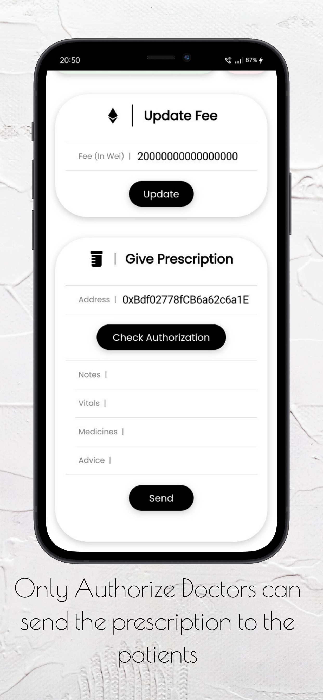</td>
  </tr>
 </table>

 ## Screenshots on Linux

 <table>
  
  <tr>
    <td>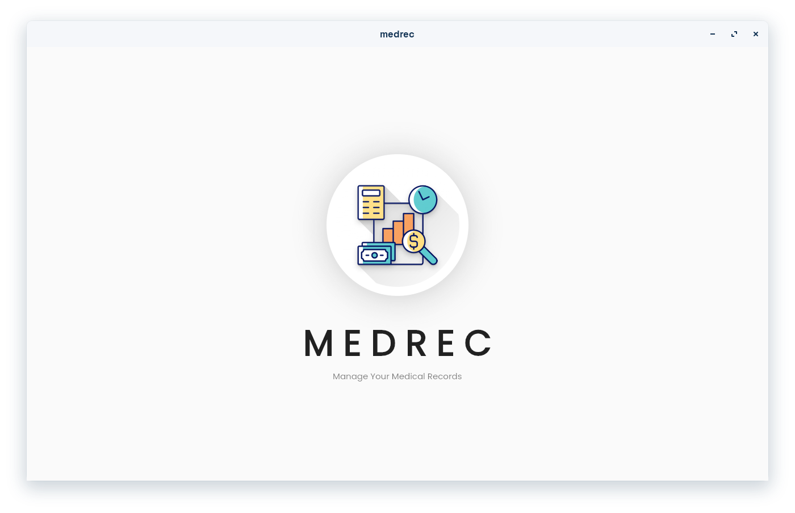</td>
  </tr>
  <tr>
    <td>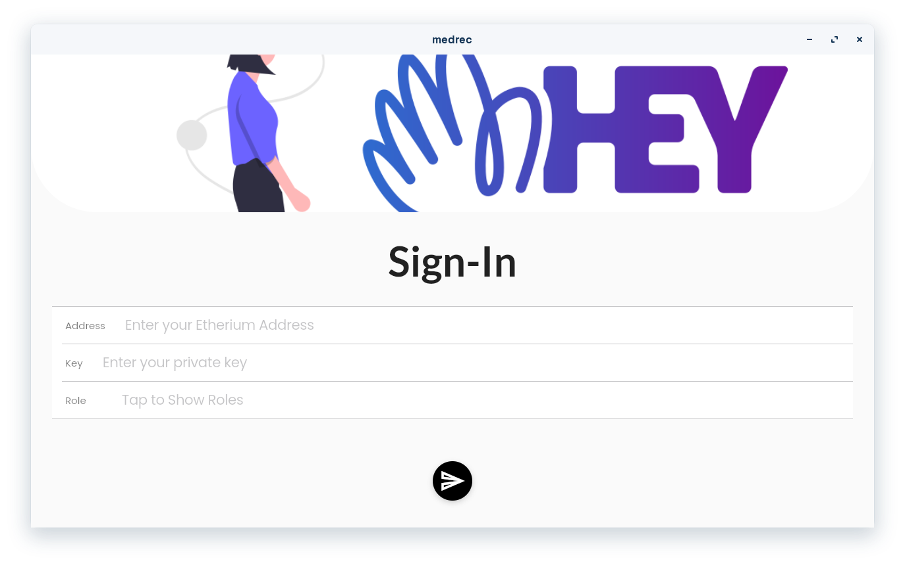</td>
  </tr>
  <tr>
    <td>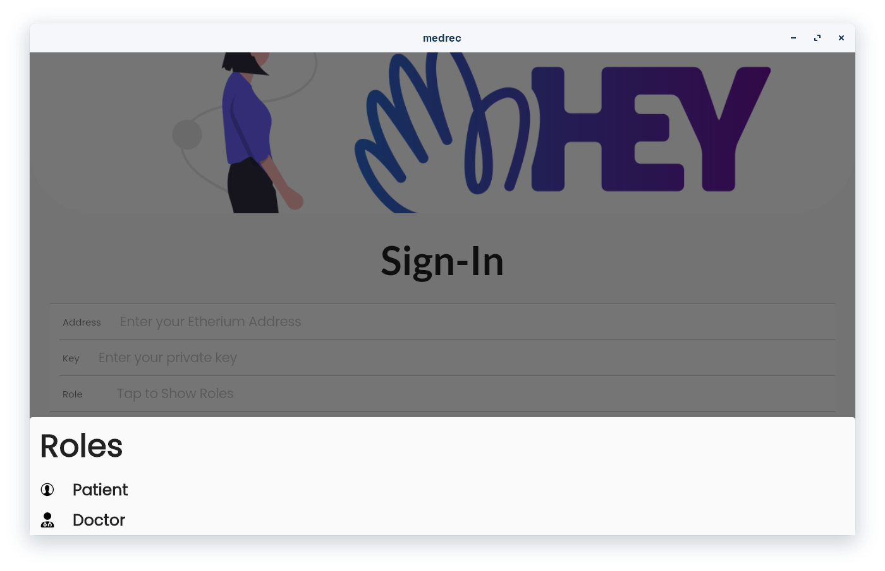</td>
  </tr>
  <tr>
    <td>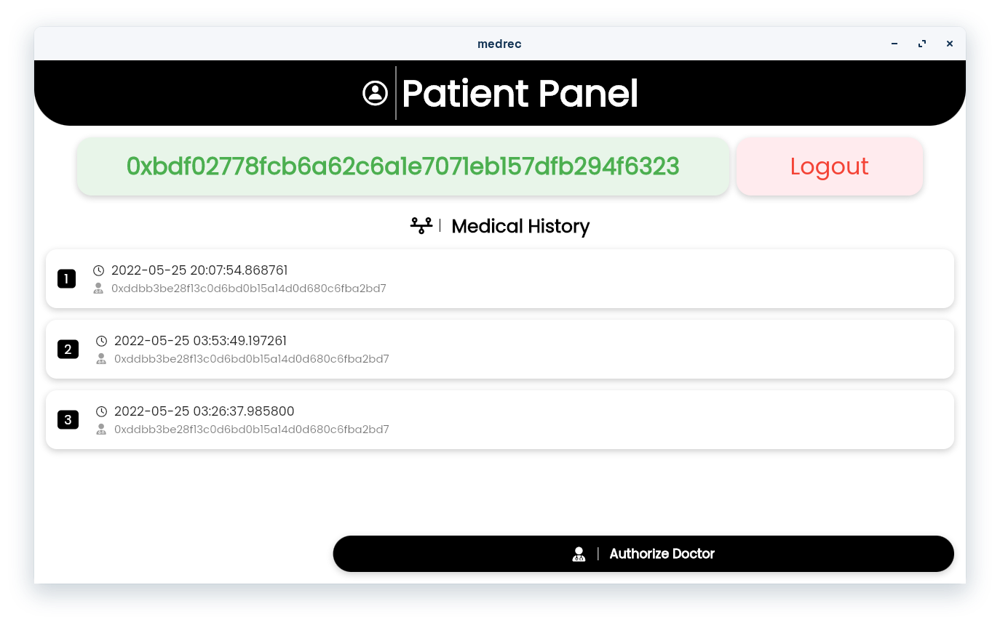</td>
  </tr>
  <tr>
    <td>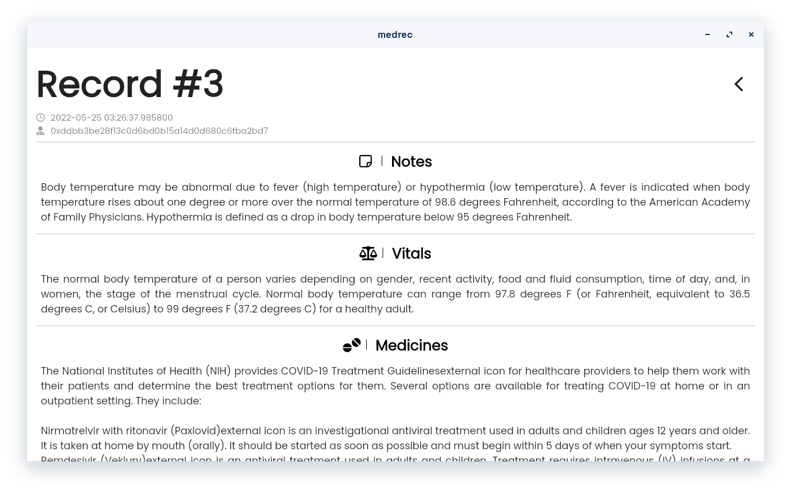</td>
  </tr>
  <tr>
    <td>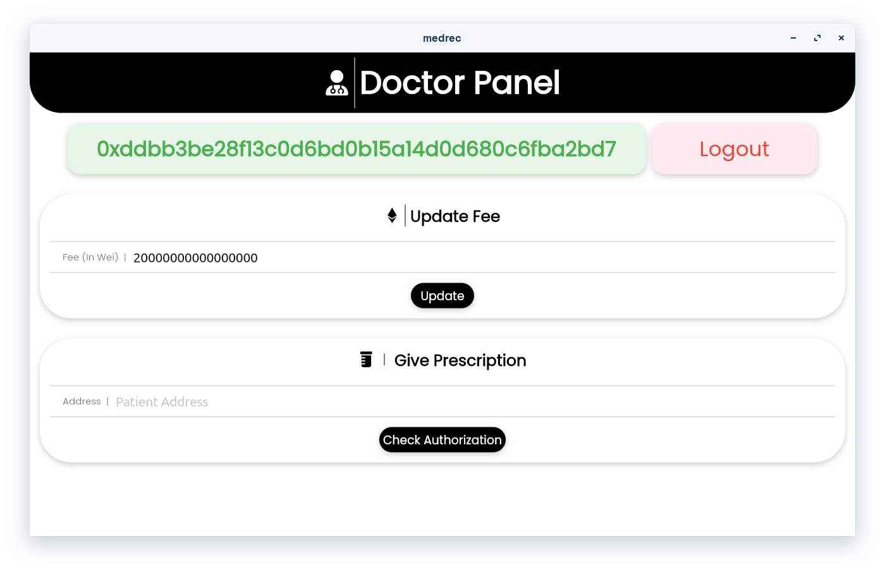</td>
  </tr>
 </table>


## Libraries & Tools Used

* [web3dart](https://github.com/xclud/web3dart)
* [http](https://github.com/dart-lang/http)
* [Cupertino_Icons](https://github.com/flutter/packages/tree/master/third_party/packages/cupertino_icons)
* [font_awesome_flutter](https://github.com/fluttercommunity/font_awesome_flutter)
* [FlutterToast](https://github.com/PonnamKarthik/FlutterToast)
* [Google Fonts](https://github.com/material-foundation/google-fonts-flutter/)

## Folder Structure
Here is the core folder structure which flutter provides.

```
flutter-app/
|- android
|- assets
|- build
|- ios
|- lib
|- test
|- linux
|- macos
|- test
|- web
|- windows
```

Here is the folder structure we have been using in this project

```
assets/
|- contracts/
        |- doctor.json
        |- patient.json
|- Icons/
        |- 1024.png
|-images
        |-welcomeImage.png

lib/
|- Pages/
        |- doctor_home_page.dart
        |- login.dart
        |- patient_home_page.dart
        |- splash_screen.dart
        |- view_prescription.dart

|- Utils/
        |- routes.dart
        |- routes.dart

|- main.dart
```

## Routes

This file contains all the routes for your application.

```dart
import 'package:flutter/material.dart';
import 'package:medrec/Pages/doctor_home_page.dart';
import 'package:medrec/Pages/login.dart';
import 'package:medrec/Pages/patient_home_page.dart';

class MyRoutes {
  static const String loginPage = "/loginPage";
  static const String doctorHomePage = "/doctorHome";
  static const String patientHomePage = "/patientHome";

  static final routes = <String, WidgetBuilder>{
    loginPage: (context) => const LoginPage(),
    doctorHomePage: (context) => const DoctorHomePage(),
    patientHomePage: (context) => const PatientHomePage(),
  };
}

```

## Main

This is the starting point of the application. All the application level configurations are defined in this file i.e, theme, routes, title, orientation etc.

```dart
import 'package:flutter/material.dart';
import 'package:flutter/services.dart';
import 'package:google_fonts/google_fonts.dart';
import 'Pages/splash_screen.dart';
import 'Utils/routes.dart';

void main() {
  SystemChrome.setSystemUIOverlayStyle(const SystemUiOverlayStyle(
      statusBarColor: Colors.black, statusBarIconBrightness: Brightness.light));
  runApp(const MyApp());
}

class MyApp extends StatelessWidget {
  const MyApp({Key? key}) : super(key: key);

  @override
  Widget build(BuildContext context) {
    return MaterialApp(
      debugShowCheckedModeBanner: false,
      theme: ThemeData(
        textTheme: GoogleFonts.poppinsTextTheme(
          Theme.of(context).textTheme,
        ),
      ),
      home: const Splash2(),
      routes: MyRoutes.routes,
    );
  }
}

```

## Solidity Contracts
[Doctor](https://github.com/Abhishekkr3003/MedRec/blob/main/solidity_contracts/doctor.sol)


[Patient](https://github.com/Abhishekkr3003/MedRec/blob/main/solidity_contracts/patient.sol)

